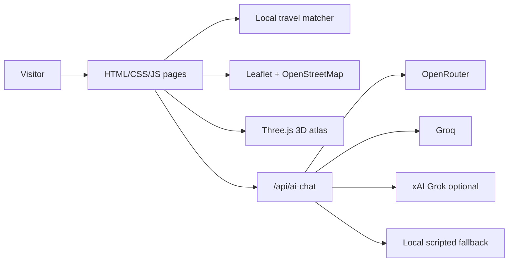

# Nikitka AI Travel

[English](README.md) | [Русский](README.ru.md)

Portfolio concept for an AI-assisted travel agency website: trip selection, route planning, a 3D route atlas, OpenStreetMap route views, and a clear trip request flow.

> [!IMPORTANT]
> This repository is public for portfolio review only. It is not open source, not a real travel agency, and not a reusable website template. See [LICENSE](LICENSE).

<p align="center">
  <a href="https://turist-nikitka.vercel.app"></a>
  
  
</p>


## What This Is

`Nikitka AI Travel` is a fictional portfolio showcase for a modern travel-agency interface. The original site concept was created as a one-hour AI-assisted sprint with Gemini 3.5 Flash, then refined, checked, and packaged as a public GitHub portfolio project.

The project demonstrates:

- responsive travel-agency landing pages;
- a local travel matcher that compares budget, trip tempo, season, and interests;
- route cards for multiple countries with Belarusian ruble pricing;
- OpenStreetMap route views without paid map keys;
- a Three.js 3D globe using the NASA Blue Marble texture;
- a Vercel serverless endpoint for optional AI chat through OpenRouter, Groq, or xAI keys;
- honest fallback behavior when no AI provider is configured.

All prices, contacts, route packages, agency details, and addresses are fictional demo data.

## Live Demo

- Production site: [turist-nikitka.vercel.app](https://turist-nikitka.vercel.app)
- AI setup notes: [AI_SETUP.md](AI_SETUP.md)
- Project history: [PROJECT_HISTORY.md](PROJECT_HISTORY.md)
- Architecture notes: [docs/architecture.md](docs/architecture.md)

## Quickstart

This is a static HTML/CSS/JavaScript project. For the visual site:

```bash
npx serve .
```

Then open the local URL shown by the server.

For `/api/ai-chat`, use Vercel's local runtime:

```bash
vercel dev
```

The browser must never receive real API keys. Put provider keys only in local ignored env files or Vercel Environment Variables. See [AI_SETUP.md](AI_SETUP.md).

## Project Structure

```text
.
├── index.html              # Main landing page
├── tours.html              # Tour catalog
├── destinations.html       # Destination page
├── contacts.html           # Fictional Minsk contact surface
├── css/                    # Visual system and responsive styles
├── js/                     # UI behavior, route atlas, matcher, catalog logic
├── api/ai-chat.js          # Vercel serverless AI endpoint
├── assets/earth/           # Earth texture source notes and image
├── docs/                   # Repo packaging, architecture, screenshots
└── AI_SETUP.md             # Provider key setup guide
```

## Architecture



The exact route map lives in the travel matcher. The lower route atlas is intentionally a 3D scenario panel, not a second map.

## Configuration

Optional server-side AI variables:

```text
AI_PROVIDER=auto
SITE_URL=https://turist-nikitka.vercel.app
OPENROUTER_API_KEY=...
OPENROUTER_MODEL=openrouter/free
GROQ_API_KEY=...
GROQ_MODEL=openai/gpt-oss-120b
XAI_API_KEY=...
XAI_MODEL=grok-4-fast
```

Use `.env.example` as a template. Do not commit `.env`, `.env.local`, API keys, tokens, or provider secrets.

## Verification

Useful local checks:

```powershell
node --check "js\main.js"
node --check "js\site-upgrades.js"
node --check "js\route-atlas.js"
node --check "api\ai-chat.js"
vercel build --prod
```

For UI changes, capture desktop and mobile screenshots and verify the live interactions in a browser.

## Repository Status

This repository is a portfolio artifact, not a production SaaS system:

- no real travel bookings are processed;
- no real payments are accepted;
- no real agency inventory is sold;
- demo prices and contact data are fictional;
- AI features depend on your own provider keys and free-tier availability.

## Contributing

This project is not open for template reuse or commercial forks. Small bug reports, documentation corrections, and security reports are welcome through the repository surfaces.

See [CONTRIBUTING.md](CONTRIBUTING.md), [SUPPORT.md](SUPPORT.md), and [SECURITY.md](SECURITY.md).

## License

Source available for portfolio review only. Copying, redistributing, selling, rebranding, hosting as another travel site, or using this repository as a template is not permitted.

See [LICENSE](LICENSE).
