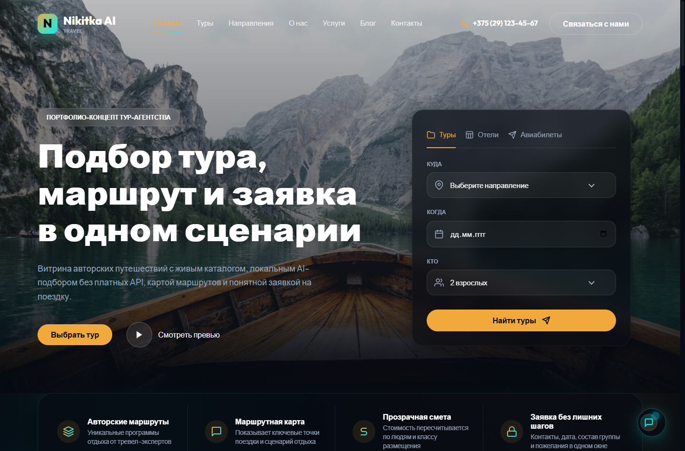
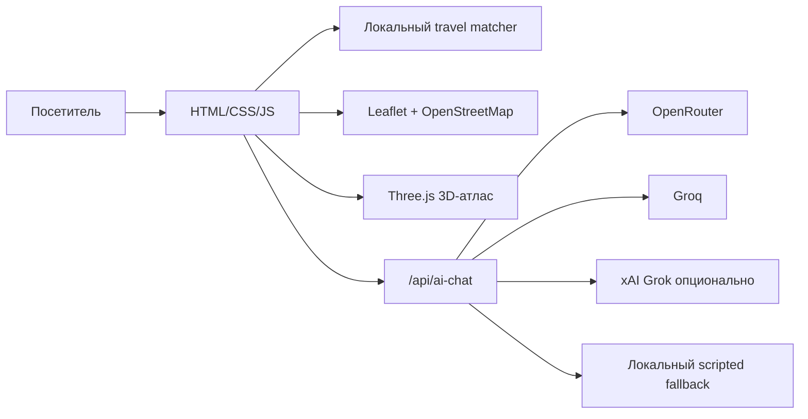

# Nikitka AI Travel

[English](README.md) | [Русский](README.ru.md)

Портфолио-концепт сайта тур-агентства: подбор тура, маршруты, 3D-атлас, OpenStreetMap-карта и понятная заявка на поездку.

> [!IMPORTANT]
> Репозиторий открыт публично только для просмотра портфолио. Это не open-source, не реальное тур-агентство и не шаблон для копирования. См. [LICENSE](LICENSE).

<p align="center">
  <a href="https://turist-nikitka.vercel.app"></a>
  
  
</p>



## Что это

`Nikitka AI Travel` — вымышленная витрина современного сайта для туристического агентства. Исходный концепт сайта был создан как AI-assisted sprint за один час в Gemini 3.5 Flash, затем доработан, проверен и упакован как публичный GitHub-проект для портфолио.

Проект показывает:

- адаптивный сайт тур-агентства;
- локальный travel matcher по бюджету, темпу, сезону и интересам;
- маршруты по разным странам с ценами в BYN;
- OpenStreetMap-карты без платных ключей;
- 3D-глобус Three.js с текстурой NASA Blue Marble;
- Vercel serverless endpoint для AI-чата через OpenRouter, Groq или xAI;
- честный fallback, если ключей AI-провайдеров нет.

Все цены, контакты, адреса, туры и данные агентства вымышлены.

## Демо

- Сайт: [turist-nikitka.vercel.app](https://turist-nikitka.vercel.app)
- Настройка AI: [AI_SETUP.md](AI_SETUP.md)
- История проекта: [PROJECT_HISTORY.md](PROJECT_HISTORY.md)
- Архитектура: [docs/architecture.md](docs/architecture.md)

## Быстрый запуск

Для визуальной части достаточно статического сервера:

```bash
npx serve .
```

Для проверки `/api/ai-chat` нужен Vercel runtime:

```bash
vercel dev
```

Настоящие API-ключи нельзя отдавать в браузер или коммитить. Храни их только в локальных ignored env-файлах или в Vercel Environment Variables. Подробности: [AI_SETUP.md](AI_SETUP.md).

## Структура

```text
.
├── index.html              # Главная страница
├── tours.html              # Каталог туров
├── destinations.html       # Направления
├── contacts.html           # Вымышленный контактный раздел Минска
├── css/                    # Визуальная система и адаптив
├── js/                     # UI, 3D-атлас, matcher, каталог
├── api/ai-chat.js          # Vercel serverless endpoint
├── assets/earth/           # Текстура Земли и источники
├── docs/                   # Документация, аудит, скриншоты
└── AI_SETUP.md             # Настройка AI-провайдеров
```

## Архитектура



Точная OSM-карта находится в travel matcher. Нижний route atlas специально сделан как 3D-сценарий, а не как вторая карта подряд.

## Проверки

```powershell
node --check "js\main.js"
node --check "js\site-upgrades.js"
node --check "js\route-atlas.js"
node --check "api\ai-chat.js"
vercel build --prod
```

Для UI-изменений дополнительно нужны desktop/mobile screenshots и проверка в браузере.

## Статус

Это портфолио, а не production SaaS:

- реальные бронирования не обрабатываются;
- платежи не принимаются;
- настоящие туры не продаются;
- цены и контакты вымышлены;
- AI зависит от ваших provider keys и текущих лимитов бесплатных моделей.

## Лицензия

Код открыт для просмотра как портфолио. Копировать, перепубликовывать, продавать, ребрендить, хостить как другой туристический сайт или использовать как шаблон нельзя.

См. [LICENSE](LICENSE).
