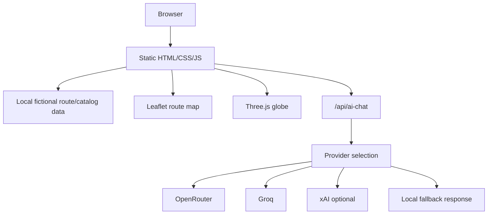

# Architecture

`Nikitka AI Travel` is a static portfolio site with one optional serverless AI endpoint.

## Runtime Surfaces

| Surface | Files | Purpose |
|---|---|---|
| Static pages | `index.html`, `tours.html`, `destinations.html`, `services.html`, `about.html`, `blog.html`, `contacts.html` | Public portfolio website pages |
| Styling | `css/variables.css`, `css/style.css`, `css/components.css` | Design tokens, layout, components, responsive behavior |
| Frontend behavior | `js/main.js`, `js/site-upgrades.js`, `js/slider.js`, `js/tours.js`, `js/route-atlas.js` | Navigation, catalog behavior, route matcher, maps, 3D atlas |
| Map layer | Leaflet + OpenStreetMap tiles | Route visualization without paid map keys |
| 3D layer | Three.js + `assets/earth/earth-blue-marble-august.jpg` | Route atlas globe using NASA Blue Marble texture |
| AI endpoint | `api/ai-chat.js` | Optional Vercel serverless provider router |

## Request Flow



## AI Provider Boundary

The frontend calls `/api/ai-chat`. API keys are read only on the serverless side through environment variables:

- `OPENROUTER_API_KEY`
- `GROQ_API_KEY`
- `XAI_API_KEY`

If no provider is configured or a free-tier limit is exhausted, the UI falls back to local scripted travel-assistant logic.

## Data Boundary

All travel offers, prices, addresses, phone numbers, routes, agency details, and testimonials are fictional demo data. The site does not process real bookings or payments.

## Deployment

The current production target is Vercel:

```text
https://turist-nikitka.vercel.app
```

Use `vercel build --prod` for build verification and `vercel deploy --prod` for production deployment.
